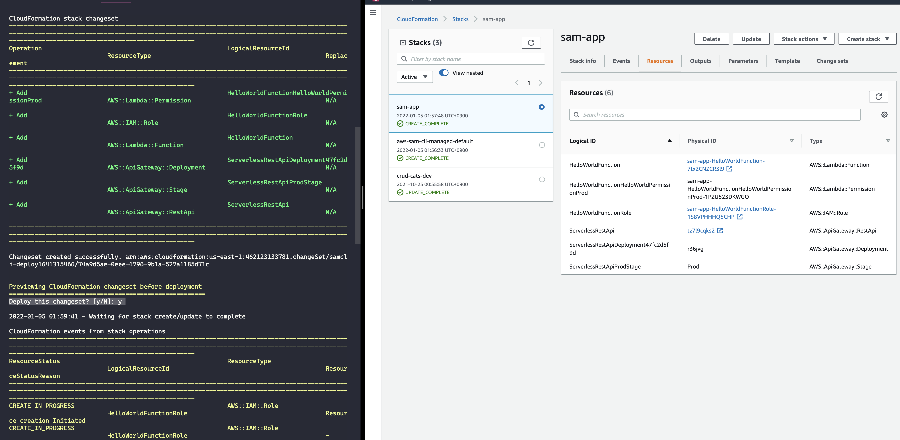
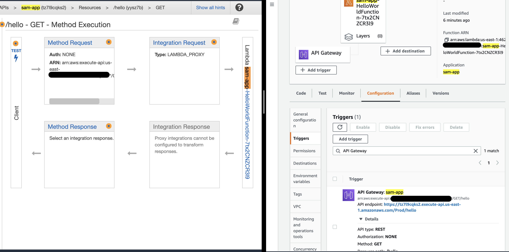

# aws-sam-lambda-apigw-python 🐳


[](https://github.com/tquangdo/aws-sam-lambda-apigw-python/issues/new)

## reference
1. [youtube](https://www.youtube.com/watch?v=MipjLaTp5nA)

## install AWS SAM CLI
```shell
brew --version
-> Homebrew 3.3.9
brew tap aws/tap
brew install aws-sam-cli
sam --version
-> SAM CLI, version 1.36.0
brew upgrade aws-sam-cli
-> Warning: aws/tap/aws-sam-cli 1.36.0 already installed
```

## SAM deploy
```shell
python3 --version
-> Python 3.9.9. MUST map with `template.yaml > Runtime: python3.9`
sam build         
-> 
...
Build Succeeded

Built Artifacts  : .aws-sam/build
Built Template   : .aws-sam/build/template.yaml
```
+
```shell
sam deploy --guided
Configuring SAM deploy
======================

        Stack Name [sam-app]: 
        AWS Region [us-east-1]: 
        #Shows you resources changes to be deployed and require a 'Y' to initiate deploy
        Confirm changes before deploy [y/N]: y
        #SAM needs permission to be able to create roles to connect to the resources in your template
        Allow SAM CLI IAM role creation [Y/n]: 
        #Preserves the state of previously provisioned resources when an operation fails
        Disable rollback [y/N]: 
        HelloWorldFunction may not have authorization defined, Is this okay? [y/N]: y
        Save arguments to configuration file [Y/n]: 
        SAM configuration file [samconfig.toml]: 
        SAM configuration environment [default]: 

        Looking for ...
```

+

+ access `https://tz7l9cqks2.execute-api.us-east-1.amazonaws.com/Prod/hello?personId=dotq` on browser will see the result:
```json
{
personId: "dotq from Lambda"
}
```

## sam local
### 1/ OK result
```shell
sam local start-api
```
+ access `127.0.0.1:3000/hello?personId=dotq` on browser will see the result:
```json
{
personId: "dotq from Lambda"
}
```
### 1/ ERR result
```shell
sam local invoke (OR sam local invoke -e ./events/event.json HelloWorldFunction)
->
Mounting /Users/NC00011462/Documents/GitHub/sam-app/.aws-sam/build/HelloWorldFunction as /var/task:ro,delegated inside runtime container
START RequestId: 8042fcec-d9a3-45b8-b895-f1404f622eea Version: $LATEST
    personId = event['queryStringParameters']['personId']
END RequestId: 8042fcec-d9a3-45b8-b895-f1404f622eea
REPORT RequestId: 8042fcec-d9a3-45b8-b895-f1404f622eea  Init Duration: 0.38 ms  Duration: 102.59 ms     Billed Duration: 103 ms Memory Size: 128 MB     Max Memory Used: 128 MB
{"errorMessage": "'queryStringParameters'", "errorType": "KeyError", "requestId": "8042fcec-d9a3-45b8-b895-f1404f622eea", "stackTrace": ["  File \"/var/task/app.py\", line 8, in lambda_handler\n    personId = event['queryStringParameters']['personId']\n"]}
```
